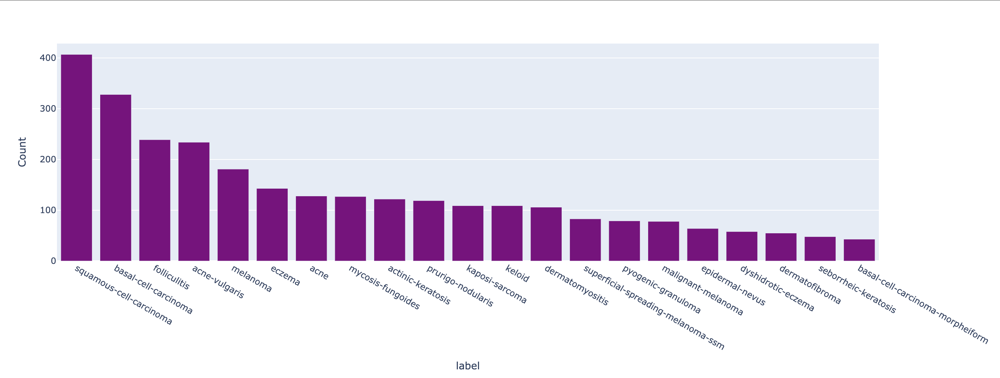

#  Equitable AI in Dermatology - AJL Kaggle Competition Team 9

---

### **👥 Team Members**

| Name | GitHub Handle | Contribution |
| ----- | ----- | ----- |
| Mia Chen | @miachen67 | Research, Initial Model Training, Model Exploration, Data Augmentation|
| Eduard Bueno | @L4S3RB0Y | Research, Data Augmentation, EDA, Model Exploration |
| Jacquelyn Garcia | @JacquelynGarcia | Research, Baseline Model, Initial Model Training, EDA, Data Visualization, README |
| Leon Ren | @leonren19 | Research, Baseline Model |
| Parini Gandhi | @pg-19 | Research |

---

## **🎯 Project Highlights**

* Built a Convolutional Neural Network using TensorFlow/Keras to classify dermatological conditions  
* Implemented data augmentation techniques to improve generalization and address skin tone representation  
* Planned fairness evaluation using performance across different skin tone groups  
* Leveraged Kaggle datasets and starter notebooks to create a baseline model  

🔗 [Equitable AI for Dermatology | Kaggle Competition Page](https://www.kaggle.com/competitions/bttai-ajl-2025/overview)

---

## **👩🏽‍💻 Setup & Execution**

```bash
# Clone the repository
git clone https://github.com/your-team/dermatology-ai-ajl.git
cd dermatology-ai-ajl

# Create a virtual environment
python -m venv venv

# On Windows: venv\Scripts\activate
source venv/bin/activate

# Install dependencies
pip install -r requirements.txt

# Run the Jupyter Notebook
jupyter notebook Copy_of_AJL_Starter_Notebook.ipynb
```

---

## **🏗️ Project Overview**

This project is part of the AJL 2025 Kaggle Competition, run in collaboration with Break Through Tech AI. The goal was to build a dermatology classifier that takes into account a wide range of skin tones, addressing fairness and bias in AI-driven healthcare.

---

## **📊 Data Exploration**

* Dataset: Dermatology images and metadata from the Kaggle competition (train.csv, test.csv)
* Explored class distributions, imbalances, and fitzpatrick values
* Planned data augmentation to expand representation
* Identified potential fairness gaps due to uneven sample counts per condition
   * There is a risk of model bias towards conditions with more images or conditions more commonly represented
   * The same goes for uneven image distribution across skin tones - darker skin tones were underrepresented and may not be classified as accurately by the model



---

## **🧠 Model Development**

* Used CNN - sequential model with Conv2D and MaxPooling layers
* Data preprocessing with rescaling, resizing, and augmentation
* Training on ~80% of data, validating on ~20%
* Evaluation metric: Accuracy

---

## **📈 Results & Key Findings**

* Early baseline model achieved 0.06105% accuracy

* Next phase includes hyperparameter tuning and deeper model evaluation

* Ongoing analysis of model performance across skin tone groups

**Potential visualizations to include:**

* Confusion matrix, precision-recall curve, feature importance plot, prediction distribution, outputs from fairness or explainability tools

---

## **🖼️ Impact Narrative**

### Model Fairness

* Applied data augmentation to improve representation of under-sampled skin tones
* Plan to use a validation strategy that measures performance across different groups
* Incorporated fairness in evaluation planning

### Broader Impact
* Enhances equitable AI in dermatology
* Increases awareness around algorithmic bias in clinical tools
* Inspires responsible ML development by integrating fairness from the ground up

---

## **🚀 Next Steps & Future Improvements**

* Evaluate performance across Fitzpatrick skin types
* Add explainability tools to interpret CNN decisions
* Test deeper architectures - ResNet, EfficientNet
* Include fairness metrics such as demographic parity
* Collect or synthesize more diverse training data if possible

---

## **📄 References & Additional Resources**

* AJL Fairness Guide
* TensorFlow/Keras Documentation
* Keras ImageDataGenerator


---


To run the notebook:
1. Make sure you’re in a Kaggle Notebook environment or have access to the dataset.
2. Install any missing libraries:
   ```bash
   pip install keras tensorflow numpy pandas
